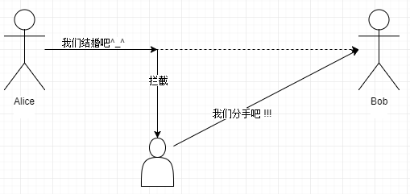
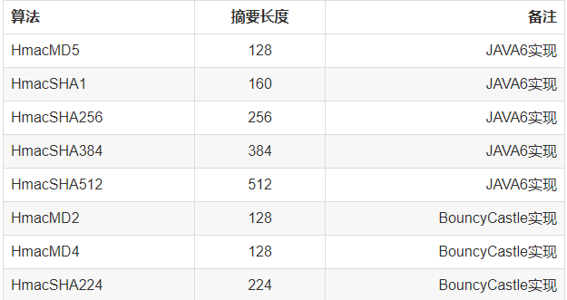

# 哈希算法
###  概念

称谓: 单向散列函数, 哈希函数, 杂凑函数, 消息摘要函数

接收的输入: 原像

输出: 散列值, 哈希值, 指纹, 摘要

### 单向散列函数特性

1. 将任意长度的数据转换成固定长度的数据
2. 很强的抗碰撞性
3. 不可逆
4. MD4/MD5
   - 不安全
   - 散列值长度: 128bit == 16byte
5. sha1
   - 不安全
   - 散列值长度: 160bit == 20byte
6. sha2 - 安全
   - sha224 
     - 散列值长度: 224bit == 28byte
   - sha256
     - 散列值长度: 256== 32byte
   - sha384
     - 散列值长度: 384bit == 48byte
   - sha512
     - 散列值长度: 512bit == 64byte
 7. 示例代码如下
```$xslt
public class HashDemo {
    public static void main(String[] args) throws Exception {
        String input = "frank";
        String md5 = getDigest(input, "MD5");
        System.out.println("md5:"+md5);
        String sha1 = getDigest(input, "SHA-1");
        System.out.println("sha1:"+sha1);
        String sha256 = getDigest(input, "SHA-256");
        System.out.println("sha256:"+sha256);
        String sha512 = getDigest(input, "SHA-512");
        System.out.println("sha512:"+sha512);

        String fileSha1 = getDigestFile("jdk-8u191-windows-x64.exe", "SHA-1");
        System.out.println("fileSha1:"+fileSha1);

    }

    /**
     * 获取消息摘要
     *
     * @param input     : 原文
     * @param algorithm : 算法
     * @return : 消息摘要
     * @throws Exception
     */
    public static String getDigest(String input, String algorithm) throws Exception {
        // 获取MessageDigest对象
        MessageDigest messageDigest = MessageDigest.getInstance(algorithm);
        // 生成消息摘要
        byte[] digest = messageDigest.digest(input.getBytes());
        return toHex(digest);

    }

    /**
     * 
     * @param filePath 文件路径
     * @param algorithm 算法
     * @return 返回对应的哈希值
     * @throws Exception
     */
    public static String getDigestFile(String filePath, String algorithm) throws Exception {
        FileInputStream fis = new FileInputStream(filePath);
        int len;
        byte[] buffer = new byte[1024];
        ByteArrayOutputStream baos = new ByteArrayOutputStream();
        while ((len = fis.read(buffer)) != -1) {
            baos.write(buffer, 0, len);
        }
        // 获取MessageDigest对象
        MessageDigest messageDigest = MessageDigest.getInstance(algorithm);
        // 生成消息摘要
        byte[] digest = messageDigest.digest(baos.toByteArray());
        return toHex(digest);

    }

    // 将字节数组转为16进制字符串
    public static String toHex(byte[] digest) {
        StringBuilder sb = new StringBuilder();
        for (byte b : digest) {
            int i = b & 0xff;
            String s = Integer.toHexString(i);
            if (s.length() == 1) {
                s = "0" + s;
            }
            sb.append(s);
        }
        return sb.toString();
    }
}
```
 

## 消息认证码
###  消息认证

> **消息认证码（message authentication code）是一种确认完整性并进行认证的技术，取三个单词的首字母，简称为MAC。**



- 思考改进方案?

  从哈希函数入手

  需要将要发送的数据进行哈希运算, 将哈希值和原始数据一并发送

  需要在进行哈希运算的时候引入加密的步骤

  - 在alice对数据进行哈希运算的时候引入一个秘钥, 让其参与哈希运算, 生成散列值
  - bob对数据校验
    - bob收到原始和散列值之后, 
      - 处理原始数据: 通过秘钥和哈希算法对原始数据生成散列值
      - 散列值比较: 生成的散列值 和  接收到的散列值进行比对

### 消息认证码的使用步骤


> 1. 前提条件:
>    - 在消息认证码生成的一方和校验的一方, 必须有一个秘钥
>    - 双方约定好使用同样的哈希函数对数据进行运算
> 2. 流程:
>    - 发送者: 
>      - 发送原始法消息
>      - 将原始消息生成消息认证码
>        - ((原始消息) + 秘钥)  *   函数函数 = 散列值(消息认证码)
>      - 将消息认证码发送给对方
>    - 接收者:
>      - 接收原始数据
>      - 接收消息认证码
>      - 校验: 
>        - ( 接收的消息  +  秘钥 ) * 哈希函数   = 新的散列值
>        - 通过新的散列值和接收的散列值进行比较

### 消息认证码的问题

1. 弊端
   - 有秘钥分发困难的问题
2. 无法解决的问题
   - 不能进行第三方证明
   - 不能防止否认
3. 消息认证码常见的算法如下:

4. 消息认证代码如下:
```$xslt
public class MacDemo {
    public static void main(String[] args) throws Exception {
        String input = "frank";
        String keyString = "123DLLFLH";
        String algorithm = "HmacSHA256";

        String hmac = generateHmac(input, keyString, algorithm);
        System.out.println(hmac);
        boolean b = verifyHamc("frank", keyString, algorithm, hmac);
        System.out.println(b);
    }

    /**
     *
     * @param input 原文
     * @param keyString 秘钥
     * @param algorithm 算法
     * @return 返回的消息认证码
     * @throws Exception
     */
   public static String generateHmac(String input,String keyString,String algorithm) throws Exception {
       Mac mac = Mac.getInstance(algorithm);
       Key key = new SecretKeySpec(keyString.getBytes(), "");
       mac.init(key);
       byte[] result = mac.doFinal(input.getBytes());
       String hmac = toHex(result);
       return hmac;
   }

    /**
     * 消息认证
     * @param input 原文
     * @param keyString 秘钥序列
     * @param algorithm 算法
     * @param hmac 传入的消息认证码
     * @return
     * @throws Exception
     */
    public static boolean verifyHamc(String input,String keyString,String algorithm,String hmac) throws Exception {
        String newHmac = generateHmac(input, keyString, algorithm);
        if (newHmac != null && newHmac.equals(hmac)) {
            return true;
        }
        return false;
    }

    // 将字节数组转为16进制字符串
    public static String toHex(byte[] digest) {
        StringBuilder sb = new StringBuilder();
        for (byte b : digest) {
            int i = b & 0xff;
            String s = Integer.toHexString(i);
            if (s.length() == 1) {
                s = "0" + s;
            }
            sb.append(s);
        }
        return sb.toString();
    }
}
```